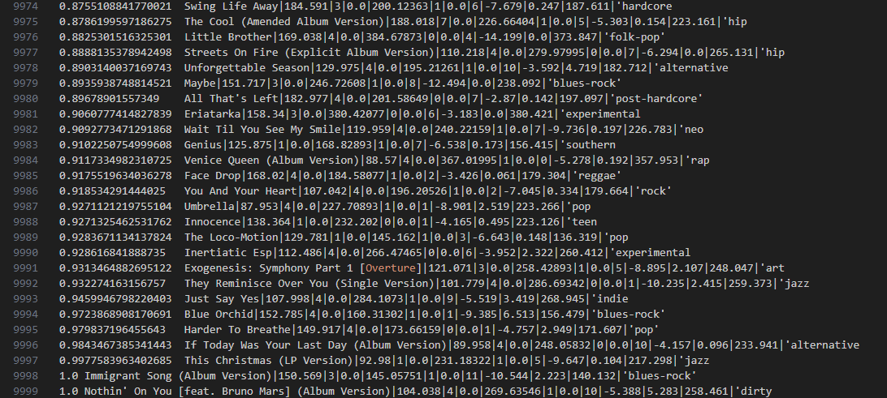
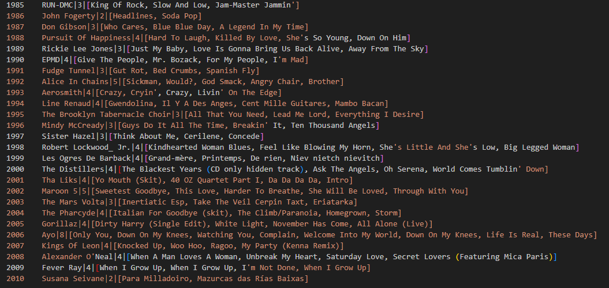

# Analysis of Million Songs Dataset using Hadoop MapReduce
#### Ayush Adhikari
<hr>
### Q1 Which artist has the most songs in the data set?
```bash
hadoop jar build/libs/Assign3.jar Q1 /hw/analysis.txt /hw/Q1 /hw/Q1sorted
hadoop fs -cat /hw/Q1sorted/part-r-00000
```
<div style="display:flex">
    
</div>
I am runnig two jobs for this question. One will select the artist as key and a int 1 as value. The reducer will group artists together and count the number of songs. This is the final output. This output is written to a file, which is the input to the second job. It will simply just sort the counts.

<hr>

### Q2 Which artist’s songs are the loudest on average?
```bash
hadoop jar build/libs/Assign3.jar Q2 /hw/analysis.txt /hw/Q2 /hw/Q2sorted
hadoop fs -cat /hw/Q2sorted/part-r-00000
```
<div style="display:flex">
    
</div>
There are two jobs. The first will write the the artist as key and the count and average as a tuple as the value. The combiner and reducer use the same reducer class and calculate the average. The output of the first job is the artist and the average loudness of all of their songs. The second job takes in that and sorts it based on the loudness.

<hr>

### Q3 What is the song with the highest hotttnesss (popularity) score?
```bash
hadoop jar build/libs/Assign3.jar Q3 /hw/analysis.txt /hw/Q3 /hw/Q3sorted
hadoop fs -cat /hw/Q3sorted/part-r-00000
```
<div style="display:flex">
    
</div>
There are two jobs. The first will write the song details, which includes data needed by question 9 as well, as the key and the hotness as the value. The second job will take in that and sort it based on the hotness.

<hr>

### Q4 Which artist has the highest total time spent fading in their songs?
```bash
hadoop jar build/libs/Assign3.jar Q4 /hw/analysis.txt /hw/Q4 /hw/Q4sorted
hadoop fs -cat /hw/Q4sorted/part-r-00000
```
<div style="display:flex">
    
</div>
There are two jobs. The first will take in the sum of the song fade in and song fade out and set that as the value. The key is the artist. This output is the input of the second job, which will sort it based on the fading.

<hr>

### Q5 What is the longest song(s)? The shortest song(s)? The song(s) of median length?
```bash
hadoop jar build/libs/Assign3.jar Q5 /hw/analysis.txt /hw/Q5 /hw/Q5sorted
hadoop fs -cat /hw/Q5sorted/part-r-00000
```
<div style="display:flex">
    <div>
        <p>Longest: </p>
        
    </div>
    <div>
        <p>Median: </p>
        
    </div>
    <div>
        <p>Shortest: </p>
        
    </div>
</div>
There are two jobs. The first will write the duration of the song as the value and song name as key. The second job will take in this as input and sort it based on the duration of the song.

<hr>

### Q6 What are the 10 most energetic and danceable songs? List them in descending order.
```bash
hadoop jar build/libs/Assign3.jar Q6 /hw/analysis.txt /hw/Q6 /hw/Q6sorted
hadoop fs -cat /hw/Q6sorted/part-r-00000
```
<div style="display:flex">
     
</div>
There are two jobs. The first will write the song as the key and the sum of danceability and energy as the value. They are both 0s, so all of the sums are 0s. The second job will take in this as input and sort them. They are all 0s.

<hr>

### Q7 Create segment data for the average song. Include start time, pitch, timbre, max loudness, max loudness time, and start loudness.
```bash
hadoop jar build/libs/Assign3.jar Q7 /hw/analysis.txt /hw/Q7/<segment_name> <1-6>
hadoop fs -cat /hw/Q7/<segment_name>/part-r-00000
```
<div>
    <ul>
        <li><a href="./hw/Q7/loudness_start/part-r-00000">Start Loudness Segment</a></li>
        <li><a href="./hw/Q7/max_loudness/part-r-00000">Max Loudness Segment</a></li>
        <li><a href="./hw/Q7/max_loudness_time/part-r-00000">Max Loudness Time Segment</a></li>
        <li><a href="./hw/Q7/pitch/part-r-00000">Pitch Segment</a></li>
        <li><a href="./hw/Q7/start_time/part-r-00000">Start Time Segment</a></li>
        <li><a href="./hw/Q7/timbre/part-r-00000">Timbre Segment</a></li>
    </ul>
</div>
I have 6 mappers for this and the appropriate mapper is set by an argument in the command line. They are in the order described in the question. Each mapper will get the appropriate column and set it as the value. The key for them is the same so that every value goes to the same reducer as an iterable. In the reducer, the value is split into numbers and it maintains a sum of each column in an array. I then divide each of the values in the array and create a String array out of that. This is written to the final output as the value and the key is the name of the job. Each is a separate output file, so Q8 contains 6 different output files.

<hr>

### Q8 Which artist is the most generic? Which artist is the most unique?
```bash
hadoop jar build/libs/Assign3.jar Q8 /hw/analysis.txt /hw/Q8 /hw/Q8sorted
hadoop fs -cat /hw/Q8sorted/part-r-00000
```
<div style="display:flex">
    <div>
        <p>Most generic: </p>
        
    </div>
    <div>
        <p>Most unique: </p>
        
    </div>
</div>
There are two jobs. The first one will calculate a weighted sum of the artist familiarity, artist hotness, and the number of terms they are defined by. All of the weights are 1/3. My reasoning was that the higher the familiarity, the more generic the artist. This is the same for the hottness. The number of terms is inversed; the more terms they have, the less generic they are. Therefore, I subtract the value from 100 and use that value. The weighted sum is the value and the key is the artist name. This is the output of the first job and the input to the second. The second job will just sort the file by the weighted sum.

<hr>

### Q9 Imagine a song with a higher hotnesss score than the song in your answer to Q3. List this song’s tempo, time signature, danceability, duration, mode, energy, key, loudness, when it stops fading in, when it starts fading out, and which terms describe the artist who made it. Give both the song and the artist who made it unique names.
```bash
hadoop jar build/libs/Assign3.jar Q9 /hw/Q3sorted/part-r-00000 /hw/changes /hw/Q9mean
hadoop fs -cat /hw/Q9mean/part-r-00000
```
<div style="display:flex">
    <div>
        <p>Mean of changes: </p>
        
    </div>
    <div>
        <p>Song with hottness 1.01: </p>
        <ul>
            <li>Hottness: 1.01</li>
            <li>Song name: unique song name</li>
            <li>Song artist: unique artist name</li>
            <li>Tempo: (104.038) + (46.53) = 150.568</li>
            <li>Time Signature: 4 - 1 = 3</li>
            <li>Danceability = 0 + 0 = 0</li>
            <li>Duration = 269.63 - 124.577 = 145.053</li>
            <li>Mode: 1 + 0 = 1</li>
            <li>Energy: 0 + 0 = 0</li>
            <li>Key: 10 - 1 = 9</li>
            <li>Loudness: -5.388 - 5.156 = -10.544</li>
            <li>Fade-in: 5.283 - 3.060 = 2.223</li>
            <li>Fade-out: 258.461 - 118.329 = 140.132</li>
            <li>Terms: 'pop', 'dirty', 'rock', 'indie', 'jazz'</li>
        </ul>
    </div>
</div>
There are two jobs. The first will take the output of the 3rd question and use it as an input. This file is already sorted. It has the hotness and the data mentioned above in the question. The mapper of the first job wll just write the text ad value and a string as the key. This way, everything goes to one reducer as an iterable. The reducer will take in that iterable, and calculate the differences for each numeric column. This is written as Q9changes and is the output of the second job. It will use the same mapper as the first, but the reducer is different. It will calculate the mean of each column and output one line with all of those values. This can be used to calculate the values for a song with a higher hottness.

<hr>

### Q10 For every year, which artists released what songs and which artist released the most number of songs?
```bash
hadoop jar build/libs/Assign3.jar Q10 /hw/analysis.txt /hw/Q10all_artists /hw/Q10max_artists
hadoop fs -cat /hw/Q10max_artists/part-r-00000
```
<div style="display:flex">
    <div>
        <p>All songs released by every artist by year. An example for 1980</p>
        
    </div>
    <div>
        <p>The most number of songs released by an artist for every year</p>
        
    </div>
</div>
There are two jobs for this and each use a different set of mapper and reducer. The first job will compute the first part of the question. The key written by the mapper is the year and the value is the concatenation of the song name and the artist name. Each year will go the reducer as a separate job. In the reducer, there is a map with the artist name as the key and a tuple with the running count and a list with song names. I loop through the iterable and add the appropriate values to the map. This will give me a String with the artist_name|count|[song1, song2, ...]. This is the value of the first output and the year is the key. The second job uses this as input and finds the max number of songs for that year. The output will just be one value for each year, and the value is the artist_name|count|[song1, song2,...].

<hr>

### Combine metadata.txt and analysis.txt into one file
```bash
hadoop jar build/libs/Assign3.jar CombineFiles /test/analysis.txt /test/metadata.txt /test/combined.txt
```
There is one job, but two mappers and one reducer. One mapper will read the analysis.txt file and the other will read the metadata.txt file. They both use the song id as the key so the reducer can get the values from each file. The iterable will essentially be two values, one from analysis and one from metadata. The mapper for the metadata will remove the song-id column because if not, the song id would appear twice in the combined file. The reducer will just combine the two values with a "|" in between; analysis is always first and metadata is second. 
